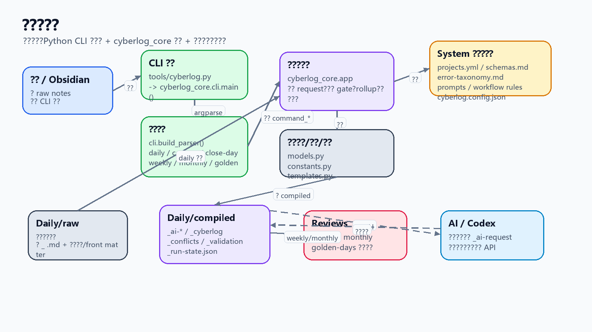
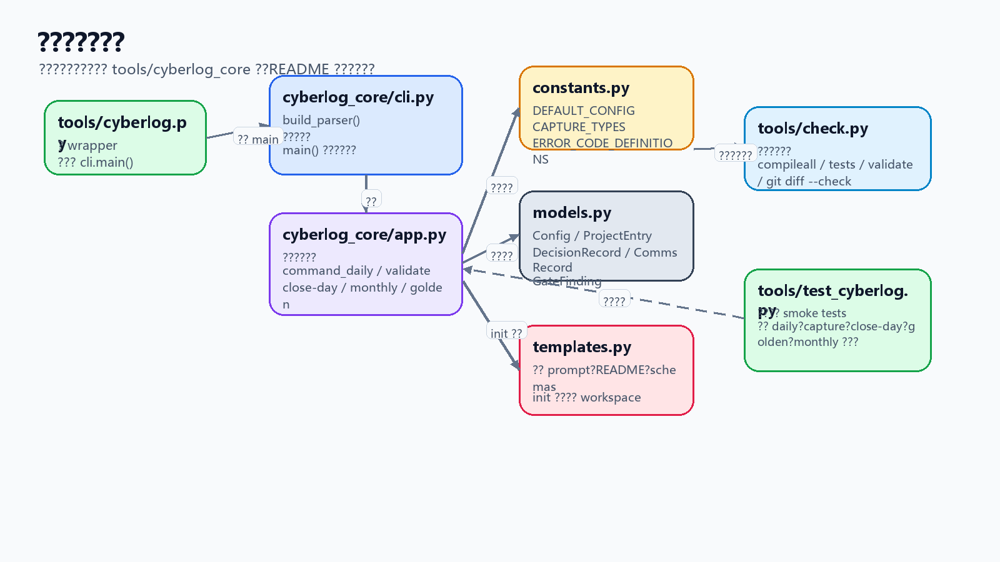
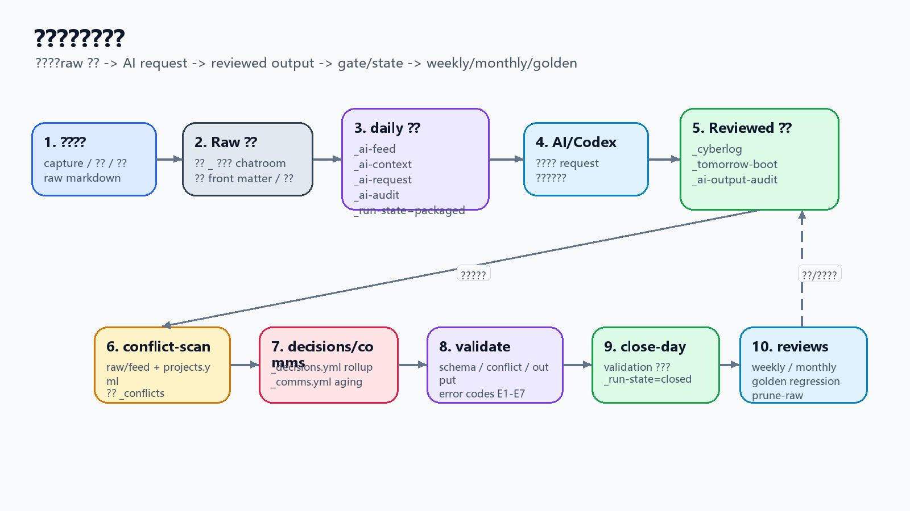
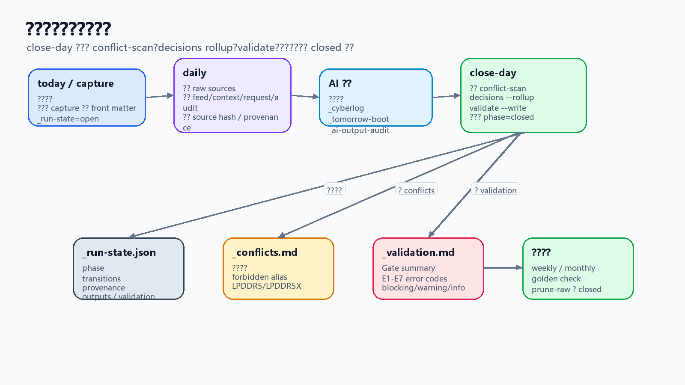
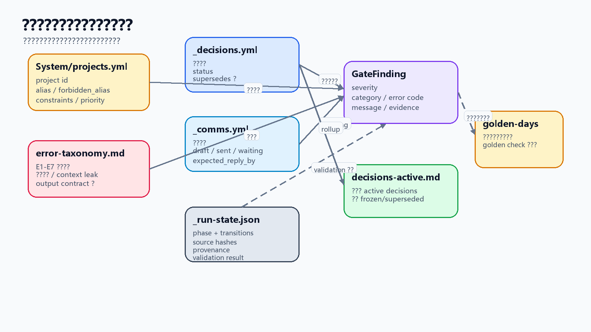

# my-daily

`my-daily` 是一个本地 daily cyberlog 工作区。它用 Python CLI 把每天的 raw markdown notes 整理成 AI request、已审核 daily record、明日启动包、冲突检查、决策 rollup、周/月复盘 request 和低人工回归契约。

本项目不是 Web 应用，也没有前端页面、后端服务、数据库、HTTP API、路由或控制器。真实入口是 [tools/cyberlog.py](./tools/cyberlog.py)，它只是一个薄 wrapper；核心代码在 [tools/cyberlog_core](./tools/cyberlog_core) 包内。所有业务状态都落在仓库内的 Markdown / YAML / JSON 文件中。

推断关系：日常 raw notes 通常来自 Obsidian、手工写入或导入压缩包；代码本身只要求 `Daily/raw/YYYY-MM-DD/` 下存在可读取的 markdown 文件。

## 项目结构与文件索引

```text
my-daily/
  tools/
    cyberlog.py                  # CLI wrapper，调用 cyberlog_core.cli.main()
    check.py                     # 轻量质量门禁：编译、测试、validate、git diff --check
    test_cyberlog.py             # smoke tests
    cyberlog_core/
      cli.py                     # argparse 子命令注册与分发
      app.py                     # 核心业务逻辑与文件管线
      models.py                  # Config、DecisionRecord、CommsRecord、GateFinding 等 dataclass
      constants.py               # 默认配置、capture 类型、错误码映射
      templates.py               # init 时写入 workspace 的内置模板
  Daily/
    raw/YYYY-MM-DD/              # 当天临时事实输入
    compiled/YYYY-MM-DD/         # AI request、daily record、gate、run-state、state files
    templates/                   # 可复制的 daily note 模板
  Reviews/
    weekly/                      # weekly request 或最终 weekly review
    monthly/                     # monthly request 或最终 monthly review
    golden-days/                 # golden day 回归契约和报告
  System/
    ai-sync-prompt.md            # daily request 中嵌入的 AI prompt
    weekly-review-prompt.md      # weekly request 中嵌入的 prompt
    monthly-review-prompt.md     # monthly request 中嵌入的 prompt
    projects.yml                 # 项目 id、alias、器件口径和约束
    schemas.md                   # 结构化状态文件格式
    error-taxonomy.md            # E1-E7 错误分类
    decisions-active.md          # decisions --rollup 生成的 active decisions view
    workflow-rules.md            # 人和 agent 都要遵守的长期规则
    personal-operating-manual.md
  docs/
    assets/                      # README 使用的架构图和数据流图
    images/                      # 既有架构图资源
    mental-models/               # AI 工程化心智模型文档
  cyberlog.config.json           # 路径、前缀、排除目录、保留期等配置
```

关键文件与目录说明：

| 路径 | 作用 |
|---|---|
| [tools/cyberlog.py](./tools/cyberlog.py) | 命令行入口 wrapper，只导入并执行 `cyberlog_core.cli.main()`。 |
| [tools/cyberlog_core/cli.py](./tools/cyberlog_core/cli.py) | CLI 分发层，注册 `daily`、`capture`、`close-day`、`weekly`、`monthly`、`golden` 等子命令。 |
| [tools/cyberlog_core/app.py](./tools/cyberlog_core/app.py) | 核心业务模块，负责读取/写入 daily 文件、生成 request、运行 gate、维护 run-state、rollup、复盘和 raw 清理。 |
| [tools/cyberlog_core/models.py](./tools/cyberlog_core/models.py) | 共享数据模型，定义 `Config`、`ProjectEntry`、`DecisionRecord`、`CommsRecord`、`GateFinding` 等结构。 |
| [tools/cyberlog_core/constants.py](./tools/cyberlog_core/constants.py) | 默认配置、capture 类型、管理标签、错误码和 finding category 映射。 |
| [tools/cyberlog_core/templates.py](./tools/cyberlog_core/templates.py) | 内置模板，`init` 会把 prompt、schema、manual、README-cyberlog 等写入工作区。 |
| [tools/check.py](./tools/check.py) | 本地质量门禁，串行运行 Python 编译、测试、daily validation 和 scoped git whitespace check。 |
| [tools/test_cyberlog.py](./tools/test_cyberlog.py) | 测试入口，使用临时目录验证 CLI 的核心命令和状态文件行为。 |
| [cyberlog.config.json](./cyberlog.config.json) | 配置文件，定义 daily 根目录、raw/compiled 路径、generated prefix、排除目录、raw 保留天数和 weekly 周号规则。 |
| [Daily/raw](./Daily/raw) | 临时事实输入层。`daily` 只纳入非 `_` 开头且不在排除目录里的 markdown 文件。 |
| [Daily/compiled](./Daily/compiled) | 已生成和已审核输出层。保存 `_ai-*`、`_cyberlog.md`、`_tomorrow-boot.md`、`_conflicts.md`、`_validation.md`、`_run-state.json`、`_decisions.yml`、`_comms.yml` 等。 |
| [Reviews/weekly](./Reviews/weekly) | 周复盘输出目录。`weekly` 只读取 compiled daily outputs 和结构化状态文件，不回读 raw。 |
| [Reviews/monthly](./Reviews/monthly) | 月复盘输出目录。`monthly` 优先读取 weekly review；缺失时才使用 weekly request 作为低可信 fallback。 |
| [Reviews/golden-days](./Reviews/golden-days) | 低人工回归契约目录。`golden add/check` 用它记录关键日期必须防复发的断言。 |
| [System/projects.yml](./System/projects.yml) | 项目注册表，定义 canonical project id、aliases、forbidden aliases、constraints 和 priority。 |
| [System/schemas.md](./System/schemas.md) | 结构化状态文件说明，面向 `_decisions.yml`、`_comms.yml`、`projects.yml`、golden contract 等。 |
| [System/error-taxonomy.md](./System/error-taxonomy.md) | 错误分类说明，帮助理解 validation / golden 中的 E1-E7 错误码。 |
| [docs/mental-models/ai-software-engineering.md](./docs/mental-models/ai-software-engineering.md) | 解释本仓库背后的 AI 工程化模型：模型负责推理，系统负责状态与验证。 |
| [docs/assets](./docs/assets) | README 图片资源目录，包含本指南引用的架构图、数据流图和概念图。 |

## 入口文件与核心模块

真实调用链如下：

```text
python3 tools/cyberlog.py ...
  -> cyberlog_core.cli.main()
  -> build_parser() 选择子命令
  -> cyberlog_core.app.command_*()
  -> 读取/写入 Daily、System、Reviews 文件
```

| 模块 | 代表函数 / 对象 | 负责什么 |
|---|---|---|
| [tools/cyberlog.py](./tools/cyberlog.py) | `main` import | 保持命令入口稳定，把运行交给 `cyberlog_core.cli`。 |
| [tools/cyberlog_core/cli.py](./tools/cyberlog_core/cli.py) | `build_parser()`、`main()` | 注册子命令、解析参数、统一捕获 `CyberlogError`。 |
| [tools/cyberlog_core/app.py](./tools/cyberlog_core/app.py) | `command_daily()`、`command_validate()`、`command_close_day()`、`command_monthly()`、`command_golden()` | 项目主要业务逻辑：daily 打包、冲突扫描、决策 rollup、validation、关闭日、复盘和回归契约。 |
| [tools/cyberlog_core/models.py](./tools/cyberlog_core/models.py) | `Config`、`DecisionRecord`、`CommsRecord`、`GateFinding` | 统一表达配置、项目、决策、沟通和 gate findings。 |
| [tools/cyberlog_core/constants.py](./tools/cyberlog_core/constants.py) | `DEFAULT_CONFIG`、`CAPTURE_TYPES`、`ERROR_CODE_DEFINITIONS` | 集中保存默认值、管理标签和错误码映射。 |
| [tools/cyberlog_core/templates.py](./tools/cyberlog_core/templates.py) | `AI_SYNC_PROMPT`、`README`、`SCHEMAS_TEMPLATE` | 保存 `init` 会写出的内置文档和 prompt。 |
| [tools/check.py](./tools/check.py) | `main()`、`run_step()` | 组合多个检查命令，适合提交前快速确认项目健康度。 |

## 总体架构图

这张图帮助你先看清项目的真实形态：用户通过 CLI 驱动本地文件管线；`cyberlog_core` 读取 System 配置和 raw notes，写入 compiled / Reviews / rollup 文件；AI/Codex 是人工触发的外部处理步骤，不由脚本自动调用。



## 模块架构拆解

### CLI 管线架构图

本项目没有前端/后端分层，核心是 `tools/cyberlog_core` 包。下图按 wrapper、CLI、业务运行时、模型/常量/模板和测试门禁拆开，方便第一次读代码时定位入口。



## 总体业务数据流图

业务主闭环是：raw notes 进入 `daily`，生成 AI request，AI/Codex 产出 reviewed daily record，然后通过 conflict / decision / validation / close-day gate 进入周复盘、月复盘、golden 回归和 raw 清理。



## 关键业务流程拆解

### 单日关闭流程

这张图聚焦一天如何从 raw 输入变成可审核的 durable daily record。图中的 AI 输出步骤不是 Python 代码自动执行，而是 `_ai-request.md` 明确要求 Codex/agent 或用户手工触发处理。



## 难点概念图解

### 状态文件与验证闭环

新手最容易混淆的是：`_cyberlog.md` 是给人读的日终记录，而 `projects.yml`、`_decisions.yml`、`_comms.yml`、`_run-state.json` 和 golden contracts 是可校验的结构化状态。下面这张图说明它们如何共同影响 validation、conflict scan、active decisions 和回归检查。



## 业务数据如何流转

1. 用户运行 `today` 或手动创建 `Daily/raw/YYYY-MM-DD/` 和 `Daily/compiled/YYYY-MM-DD/`；`today` 会写 `_run-state.json`，phase 为 `open`。
2. 用户通过 `capture`、手工写入或导入方式，把当天 markdown 放进 [Daily/raw](./Daily/raw)。结构化 capture 可写 front matter；正文中的少量管理标签会被 `file_block()` 提取成 feed 属性。
3. `daily --date YYYY-MM-DD` 读取 raw 目录，排除 `_` 开头文件和 `daily_exclude_dirs` 中的目录，生成 `_ai-feed.md`。
4. `daily` 同时读取历史 compiled 输出，生成 `_ai-context.md`；这些内容只能作为历史上下文，不是今天事实。
5. `daily` 读取 [System/ai-sync-prompt.md](./System/ai-sync-prompt.md) 和 [System/projects.yml](./System/projects.yml)，组合出 `_ai-request.md`，并写 `_ai-audit.md`、source hashes、provenance 和 phase `packaged`。
6. AI/Codex 根据 `_ai-request.md` 生成 `_cyberlog.md`、`_tomorrow-boot.md` 和 `_ai-output-audit.md`。这是人工或 agent 触发的步骤，不是脚本自动 API 调用。
7. `conflict-scan` 从 raw/feed 和 project registry 生成 `_conflicts.md`，暴露 forbidden alias、LPDDR5/LPDDR5X 和 constraints 冲突。
8. 如果当天有跨日决策或沟通状态，用户维护 `_decisions.yml` 和 `_comms.yml`。
9. `decisions --rollup` 汇总历史 `_decisions.yml`，更新 [System/decisions-active.md](./System/decisions-active.md)。
10. `validate` 汇总 schema、source、output contract、conflict、decision integrity 和 comms aging findings；finding 会映射到 [System/error-taxonomy.md](./System/error-taxonomy.md) 中的 E1-E7 错误码。
11. `close-day --date YYYY-MM-DD` 串起 conflict-scan、decisions rollup 和 validate；当 validation 无 blocking 时，把 `_run-state.json` phase 更新为 `closed`。
12. `weekly` 只读取 [Daily/compiled](./Daily/compiled)，生成 [Reviews/weekly](./Reviews/weekly) 下的周复盘 request。
13. `monthly` 优先读取 weekly review 和长期状态文件，生成 [Reviews/monthly](./Reviews/monthly) 下的月复盘 request。
14. `golden add/check` 把关键日期的 validation 错误码和文件断言变成回归契约，保存在 [Reviews/golden-days](./Reviews/golden-days)。
15. `prune-raw` 只清理完成 gate 通过且 `_run-state.json` phase 为 `closed` 的 raw 目录，并写 `_raw-discard-log.md`。

## 关键概念速查

| 概念 | 新手理解方式 |
|---|---|
| raw input | 当天原始输入，短期保留，不能覆盖。 |
| compiled output | 已生成和已审核输出，是未来恢复上下文的主要来源。 |
| generated prefix `_` | 用来区分 AI/工具生成文件和人写 raw notes；`daily` 会排除 raw 中 `_` 开头文件。 |
| `_ai-feed.md` | 今天真正喂给 AI 的 raw evidence。 |
| `_ai-context.md` | 历史上下文，只能帮助理解连续性，不能当今日事实。 |
| `_ai-request.md` | 给 AI/Codex 的任务包，不是最终结果。 |
| `_cyberlog.md` | 已审核日终记录，面向人阅读。 |
| `_tomorrow-boot.md` | 第二天启动包，用来降低恢复上下文成本。 |
| `_run-state.json` | 显式运行状态，记录 phase、transitions、source hashes、provenance、validation result。 |
| `System/projects.yml` | 项目名称、alias、器件口径和约束的规范来源。 |
| `_decisions.yml` | 机器可读的跨日决策状态，供 rollup 使用。 |
| `_comms.yml` | 机器可读的沟通状态，供 aging check 使用。 |
| `GateFinding` | validation / conflict scan / golden check 中的 finding，严重度为 `info`、`warning` 或 `blocking`。 |
| E1-E7 | 错误分类，定义在 [System/error-taxonomy.md](./System/error-taxonomy.md)，用于把 AI/output 错误变成可追踪模式。 |
| golden day | 关键日期的低人工回归契约，用来防止重要错误复发。 |

## 常用命令

```bash
python3 tools/cyberlog.py init
python3 tools/cyberlog.py today
python3 tools/cyberlog.py capture --type decision --project cyberlog-workflow "记录一条结构化决策"
python3 tools/cyberlog.py daily --date YYYY-MM-DD
python3 tools/cyberlog.py conflict-scan --date YYYY-MM-DD
python3 tools/cyberlog.py decisions --rollup --through YYYY-MM-DD
python3 tools/cyberlog.py validate --date YYYY-MM-DD
python3 tools/cyberlog.py close-day --date YYYY-MM-DD
python3 tools/cyberlog.py weekly --start YYYY-MM-DD --end YYYY-MM-DD
python3 tools/cyberlog.py monthly --start YYYY-MM-DD --end YYYY-MM-DD
python3 tools/cyberlog.py golden add --date YYYY-MM-DD
python3 tools/cyberlog.py golden check --strict
python3 tools/cyberlog.py prune-raw --older-than 7
python3 tools/check.py --date YYYY-MM-DD
```

Windows 环境如果没有 `python3` 命令，使用 `python` 运行同样参数即可。
