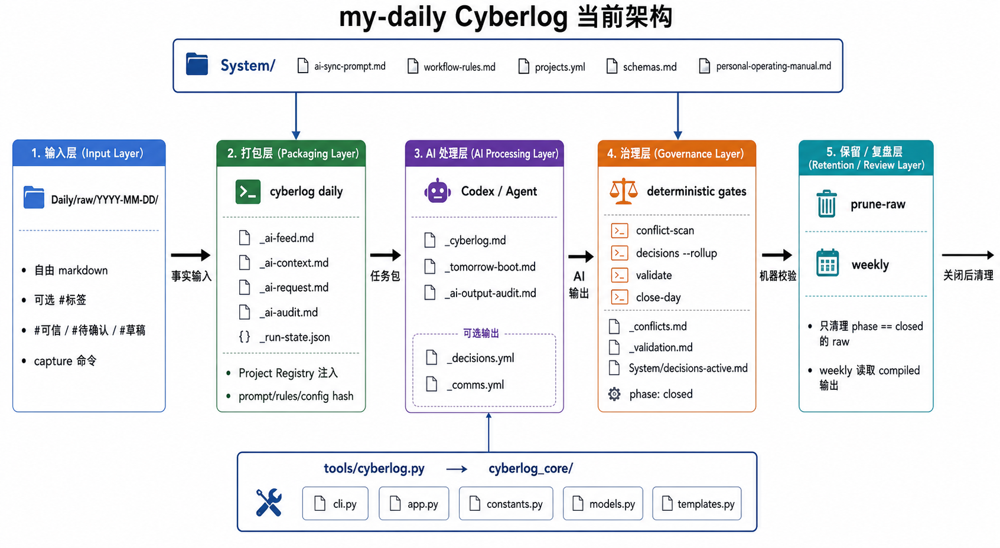

# my-daily

Personal daily cyberlog workspace.

This repo is a reviewed daily work/life cyberlog, not a permanent evidence archive.

## Architecture

Current policy:

- `Daily/raw/YYYY-MM-DD/` is a temporary fact input layer.
- Raw files must not be overwritten while retained, but completed raw folders may be pruned after 7 days.
- `Daily/compiled/YYYY-MM-DD/_cyberlog.md` and `_tomorrow-boot.md` are the durable daily record.
- `_ai-feed.md` and `_ai-request.md` are generated intermediates, not the book.
- `_ai-context.md` is historical context only; it is not today's evidence.
- Raw cleanup should leave `_raw-discard-log.md` in the matching compiled folder.

For AI agents:

1. Read [System/workflow-rules.md](System/workflow-rules.md) before acting.
2. Read [System/personal-operating-manual.md](System/personal-operating-manual.md) for current operating policy.
3. Treat old compiled `_ai-request.md` files as historical artifacts from the rules at generation time.
4. Do not infer that raw cleanup means the daily record is incomplete.

Start here:

- [README-cyberlog.md](README-cyberlog.md)
- [System/workflow-rules.md](System/workflow-rules.md)
- [System/personal-operating-manual.md](System/personal-operating-manual.md)
- [Daily/compiled](Daily/compiled)
